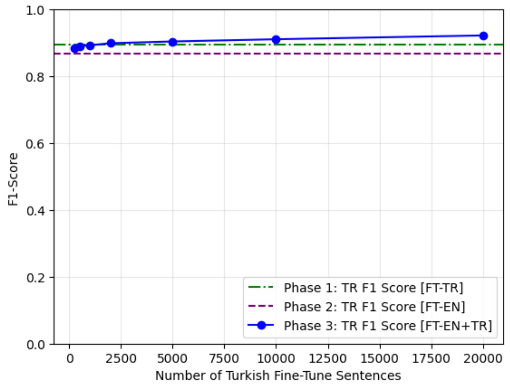

# Cross-Lingual NER Adaptation

This repository presents a Cross-Lingual Named Entity Recognition (NER) Adaptation on Turkish with the fine-tuned `xlm-roberta-base` model.

---

## Phases

- Phase 1: EN and TR Benchmark results of XLM-R (fine-tuned on TR)
- Phase 2: EN and TR Benchmark results of XLM-R (fine-tuned on EN)
- Phase 3: EN and TR Benchmark results of XLM-R (fine-tuned on EN + [Incremental TR])

---

## Evaluation Metrics of Phases

|   Phases      | EN-FT Samples | TR-FT Samples | English F1-Score | Turkish F1-Score |
|:-------------:|:-------------:|:-------------:|:----------------:|:----------------:|
|   Phase 1     |      0        |      20000    |       0.62       |       0.89       |
|   Phase 2     |      20000    |      0        |       0.81       |       0.86       |
|   Phase 3.1   |      20000    |      250      |       0.80       |       0.88       |
|   Phase 3.2   |      20000    |      500      |       0.80       |       0.89       |
|   Phase 3.3   |      20000    |      1000     |       0.79       |       0.89       |
|   Phase 3.4   |      20000    |      2000     |       0.79       |       0.89       |
|   Phase 3.5   |      20000    |      5000     |       0.79       |       0.90       |
|   Phase 3.6   |      20000    |      10000    |       0.77       |       0.91       |
|   Phase 3.7   |      20000    |      20000    |       0.76       |       0.92       |

> *Note – English F1-scores decreases slightly as more Turkish data is added, reflecting capacity re-allocation. Scores remain ≥ 0.76.*

---

## Turkish Adaptation Curve
F1 score vs. number of Turkish fine-tuning samples

---

## Dataset

- Source: PAN-X from the [google/xtreme](https://huggingface.co/datasets/google/xtreme).
- Languages: English, Turkish
- Training size 20K (EN) + 20K (TR) rows
- Validation size 10K (EN) + 10K (TR)
- Test size 10K (EN) + 10K (TR)

---

## Links

- [Hugging Face Model](https://huggingface.co/mehmet0sahinn/xlm-roberta-base-cased-ner-turkish)
- [Kaggle Notebook](https://www.kaggle.com/code/mehmet0sahinn/cross-lingual-ner-adaptation)
