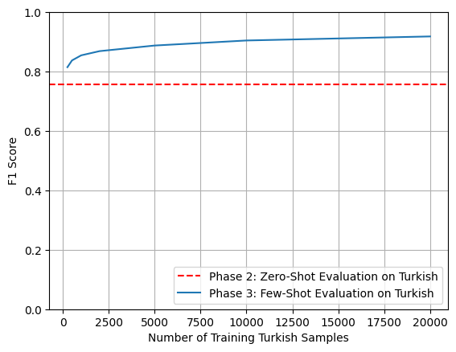

# Cross-Lingual NER with XLM-R: Zero & Few-Shot Adaptation to Turkish

This repository presents a multilingual Named Entity Recognition (NER) model fine-tuned on Turkish using the `xlm-roberta-base` model. The training data is derived from the PAN-X dataset within the XTREME benchmark.

## Project Overview

- Base Model: xlm-roberta-base (cased)
- Task: Token Classification (NER)
- Dataset: PAN-X Turkish (from XTREME)
- Transfer Setup: Few-shot learning from English to Turkish
- Final Evaluation: Over 92% F1-score

## Final Evaluation Metrics

- Accuracy: 0.9725
- Loss: 0.1222
- Precision: 0.9212
- Recall: 0.9335
- F1 Score: 0.9273

| Training Loss | Epoch | Step | Validation Loss | Accuracy | Precision | Recall | F1     |
| ------------- | ----- | ---- | --------------- | -------- | --------- | ------ | ------ |
| No log        | 1.0   | 417  | 0.1159          | 0.9689   | 0.9042    | 0.9274 | 0.9157 |
| 0.0895        | 2.0   | 834  | 0.1148          | 0.9707   | 0.9185    | 0.9228 | 0.9207 |
| 0.0895        | 3.0   | 1251 | 0.1209          | 0.9714   | 0.9171    | 0.9311 | 0.9241 |
| 0.0485        | 4.0   | 1668 | 0.1222          | 0.9725   | 0.9212    | 0.9335 | 0.9273 |

## Few-Shot Learning Curve

The following chart illustrates how the model's F1 score improves on Turkish as the number of fine-tuning samples increases.



## Usage Example

```python
from transformers import AutoTokenizer, AutoModelForTokenClassification, pipeline

model = AutoModelForTokenClassification.from_pretrained("mehmet0sahinn/xlm-roberta-base-cased-ner-turkish")
tokenizer = AutoTokenizer.from_pretrained("mehmet0sahinn/xlm-roberta-base-cased-ner-turkish")

nlp = pipeline("ner", model=model, tokenizer=tokenizer, aggregation_strategy="simple")

text = "Mustafa Kemal Atatürk 1881 yılında Selanik'te doğdu."
ner_results = nlp(text)

for entity in ner_results:
    print(entity)
```

## Dataset

- Source: PAN-X (from [XTREME Benchmark](https://huggingface.co/datasets/xtreme))
- Language: Turkish (target), English (source)
- Train Size: 20,000
- Validation Size: 10,000
- Test Size: 10,000

## Resources

- [Hugging Face Model](https://huggingface.co/mehmet0sahinn/xlm-roberta-base-cased-ner-turkish)
- [Kaggle Notebook](https://www.kaggle.com/code/mehmet0sahinn/cross-lingual-ner-on-xlm-r)

## Installation

```bash
pip install -r requirements.txt
```

## Running the Demo Locally

```bash
cd gradio
python app.py
```

## License

This repository is licensed under the MIT License.
